# 🎭 TimeTicket (타임티켓) - 문화예술 타임커머스 플랫폼

> **React & SPA 기반의 공연·전시 타임커머스 웹 애플리케이션**

🔗 **[웹사이트 바로가기 (배포 링크)](https://rudals0578-max.github.io/)**  
📁 **[발표 자료 원본 다운로드 (PPTX)](./TimeTicket_Portfolio.pptx?raw=true)**

---

## 🖥️ 프로젝트 포트폴리오 슬라이드

### 01. 표지
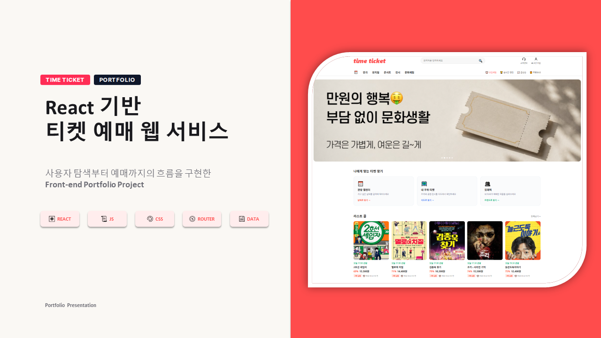

### 02. 목차
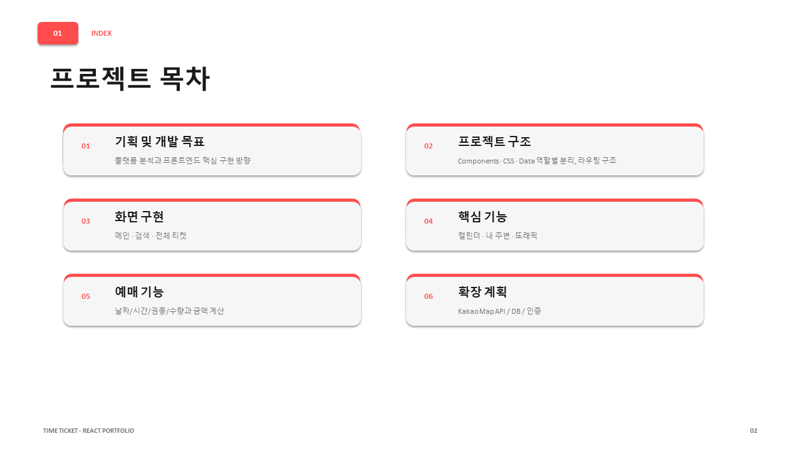

### 03. 기획 및 개발 목표
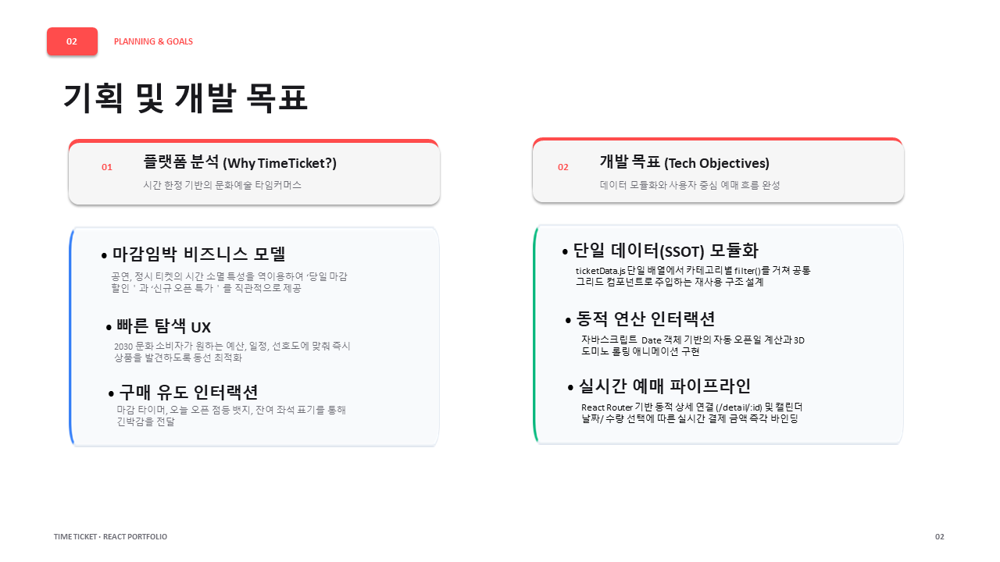

### 04. 프로젝트 구조 설계
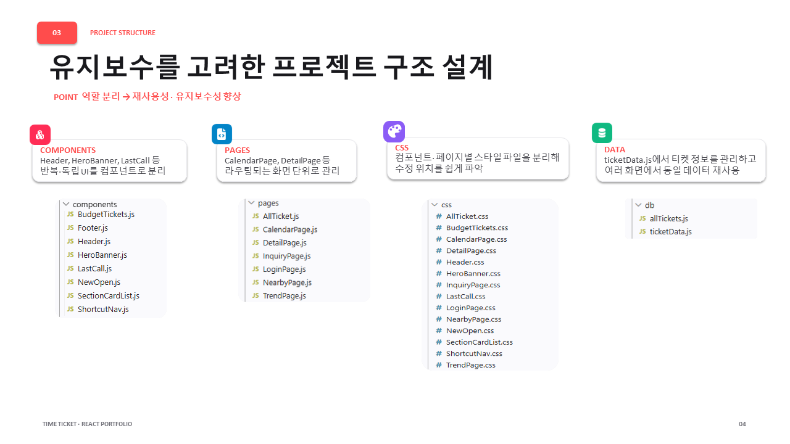

### 05. SPA 동적 라우팅 설계
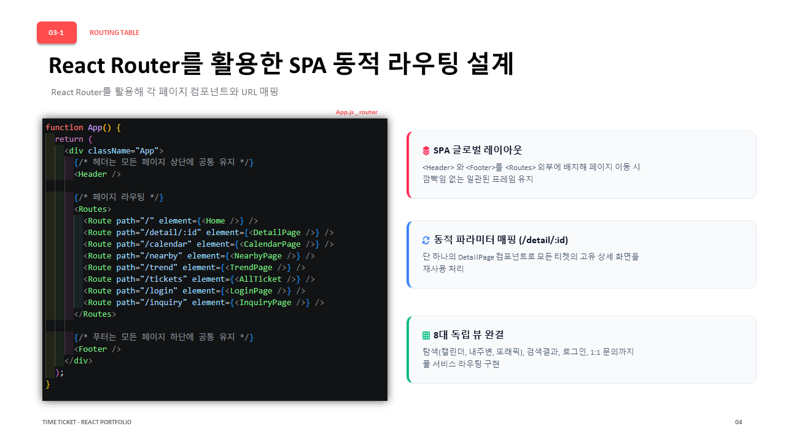

### 06. 컴포넌트 조합 메인 화면
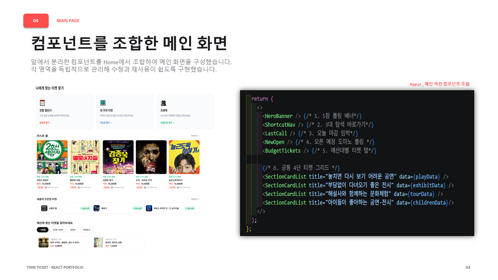

### 07. 검색어 동적 필터링
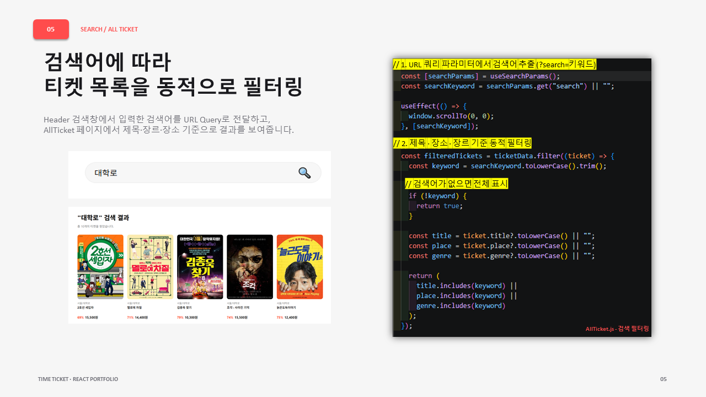

### 08. 맞춤 탐색 3가지 방법
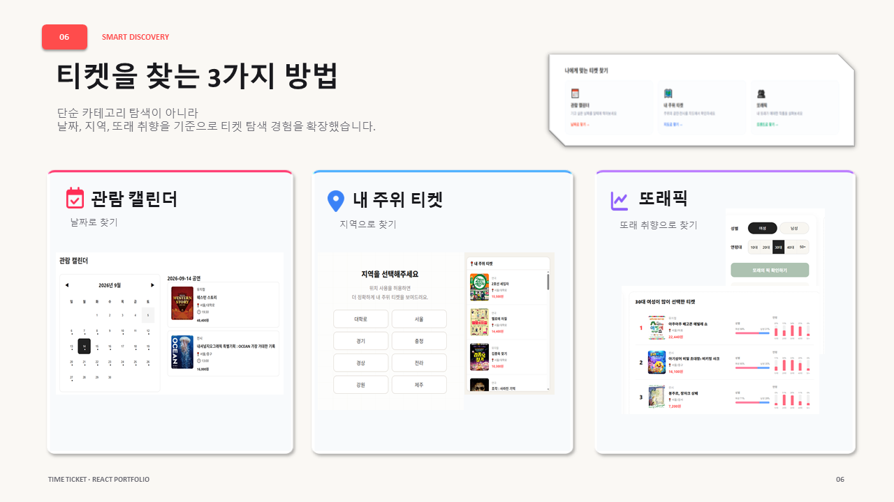

### 09. 관람 캘린더
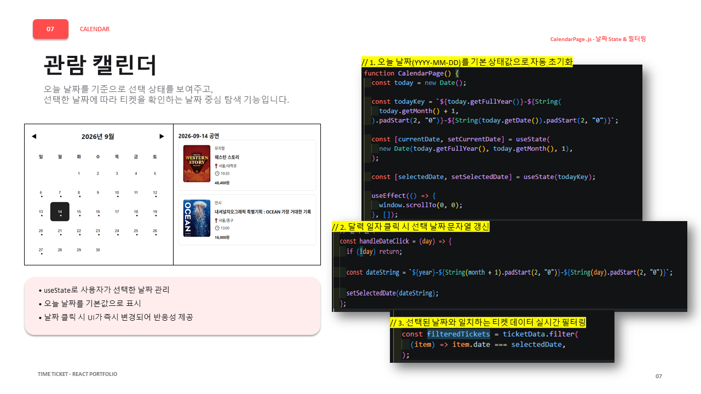

### 10. 내 주위 티켓
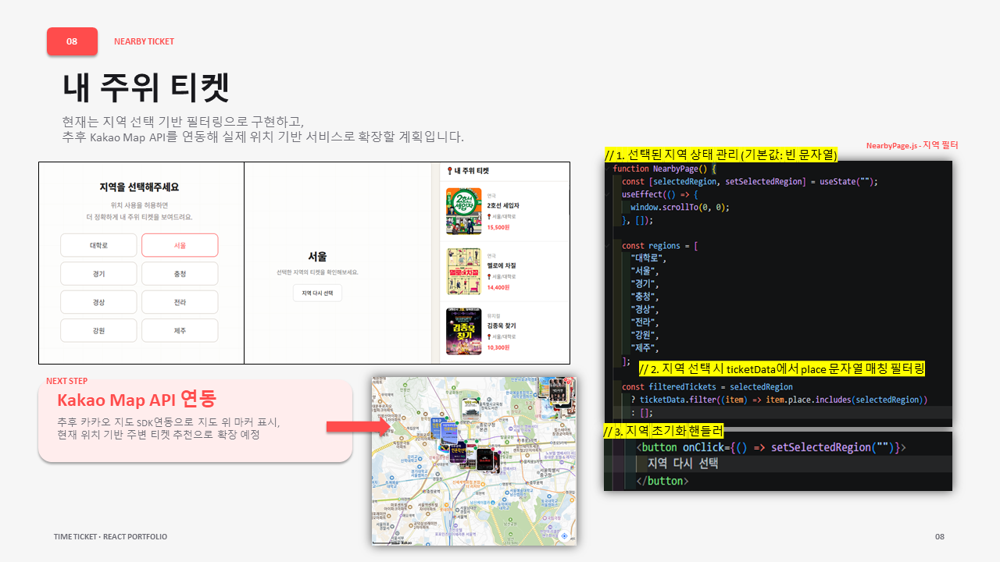

### 11. 또래픽
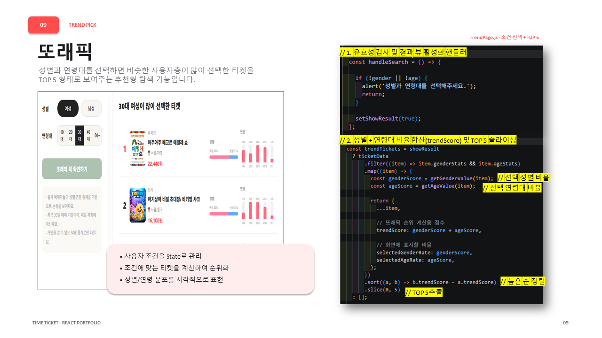

### 12. 상세 페이지 및 실시간 예매 계산
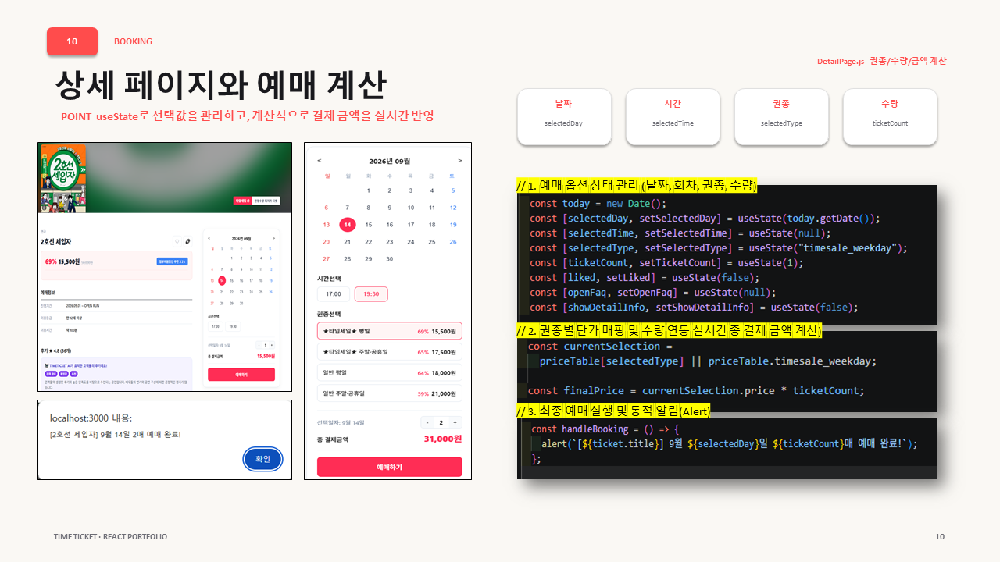

### 13. 서비스 완결성 (로그인 & 1:1 문의)
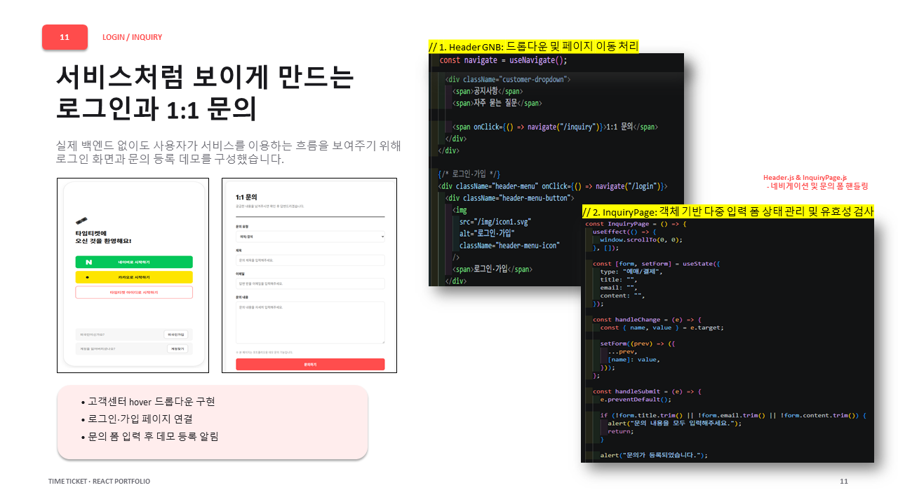

### 14. 마무리
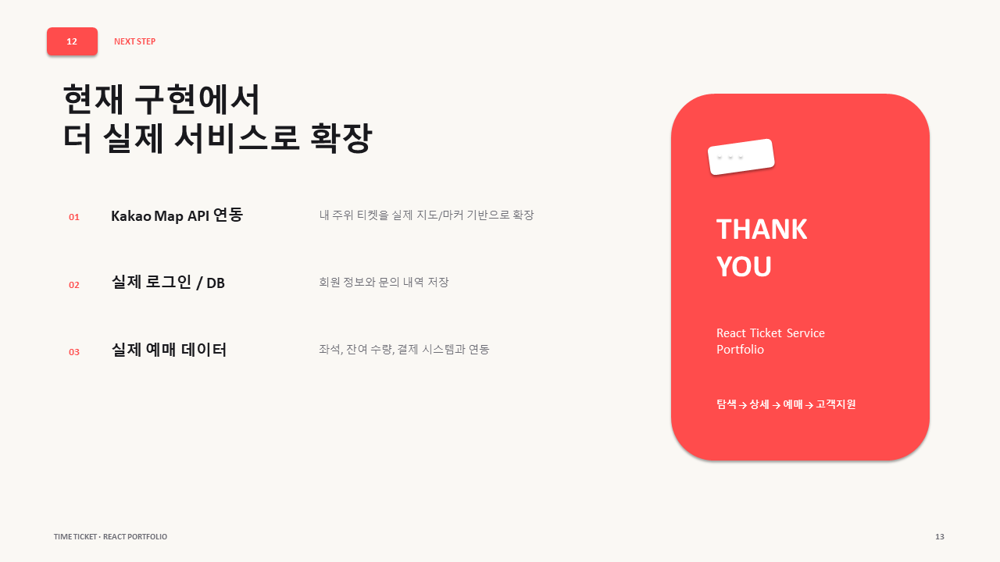
